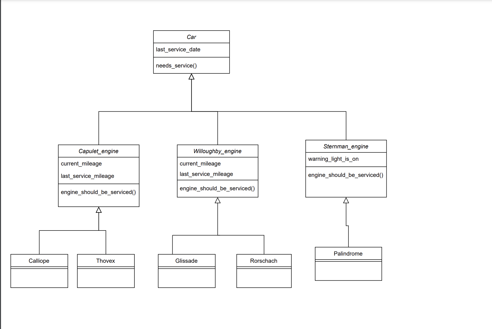
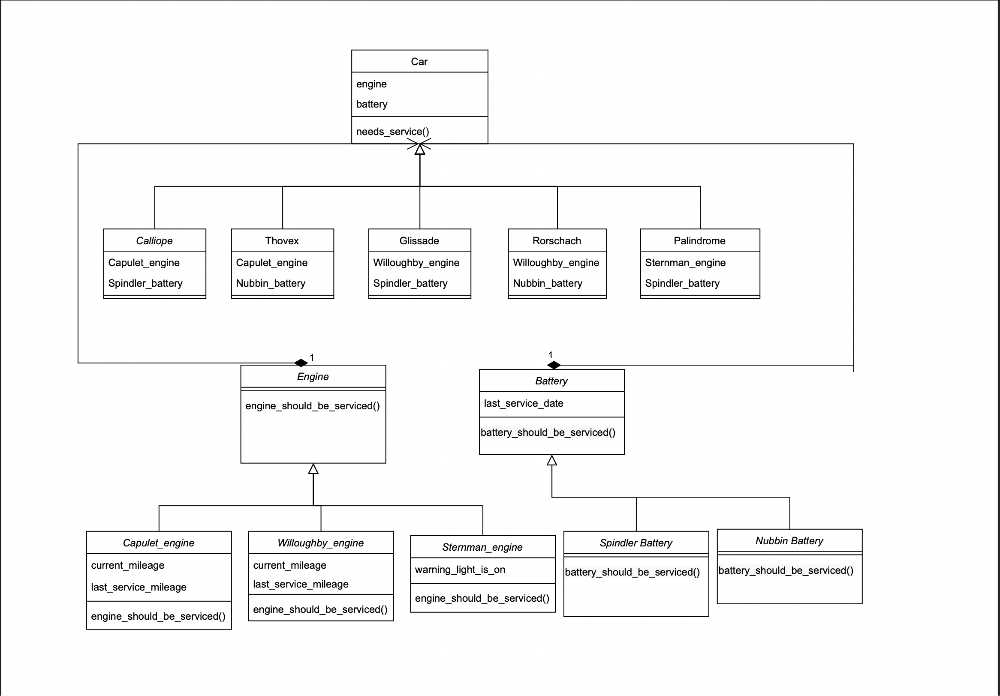
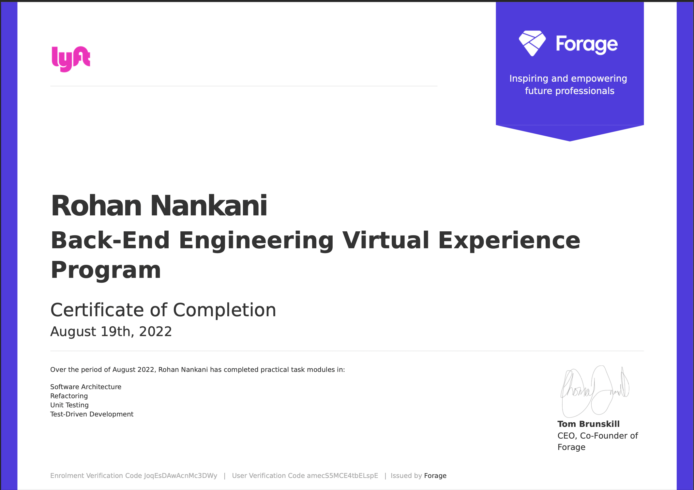

# Lyft Backend Engineering Virtual Experience Program

It is an opportunity to learn practical tasks for a back-end engineer. This is my submission for task modules in Python. 

## What I learnt

1. Software Architecture:
    - Come up with a clean design for a messy component
2. Refactoring
    - Refactor a messy system
3. Unit Testing:
    - Write unit tests for a newly refactored system
4. Test-Driven Development:
    - Add new functionality using TDD

## Description of Tasks  

We are initially given a messy component utilized by the rental fleet’s new logistics system. The component is responsible for determining whether cars in Lyft’s new rental fleet should be serviced when they are returned.

The first task is to come up with a clean design for this component to make it extensible and easy to modify, so new service criteria can be added quickly and efficiently. Then, we refactor , write unit tests, and add new functionality using TDD.

### How to run tests

`bash
python -m unittest test/test_car.py
`

## UML Diagram

- Initial UML diagram 

- Refactored UML diagram

## Certificate

